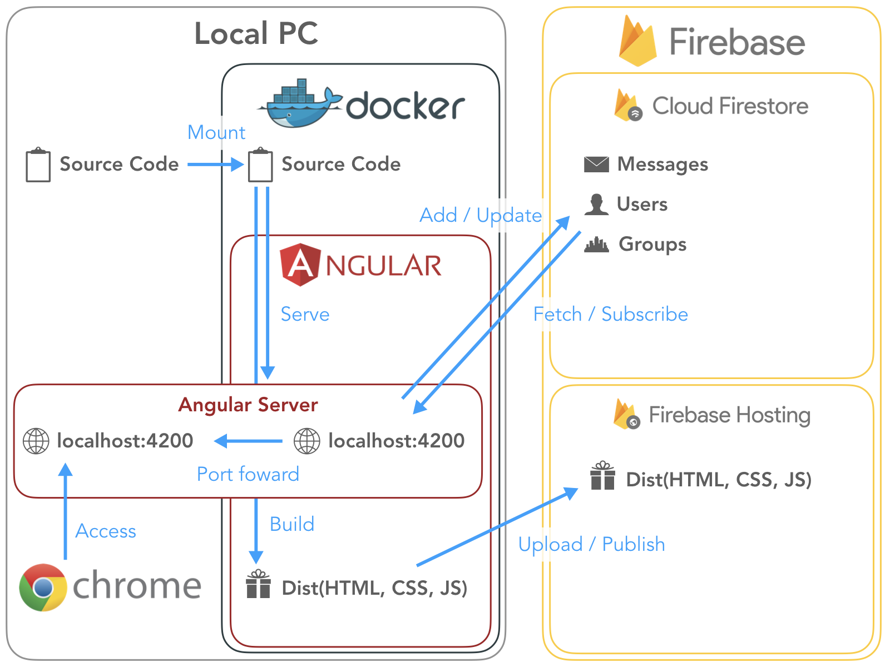

[DreamArts 20卒対象 11/11開催 ライブコーディング＆CTOが語るグロースハック](https://www.wantedly.com/projects/249398)  

# 超絶ライブコーディング Angularで作るWEBアプリケーション
## Overview
This is simple chat app by [Angular 7](https://angular.jp/) and [Cloud Firestore](https://firebase.google.com/products/firestore/).   
You need not install node.js and angular-cli and etc, then you can try quickly. Because Angular project build on docker.  



## Installation
1. Install docker and git on your PC.
    - [About Docker CE | Docker Documentation](https://docs.docker.com/install/)
    - [Git - Installing Git](https://git-scm.com/book/ja/v1/使い始める-Gitのインストール)
1. Download this repository.
    - `$ git clone https://github.com/rettar5/20181111_1day_intern.git`
    - `$ cd 20181111_1day_intern.git`
1. Build docker image.
    - `$ ./bin/build-image` of `$ docker build -t rettar5/1dayintern .`
1. Setup authentication of firebase.
    - `$ cp chatapp/src/environments/firebase.config.ts.sample chatapp/src/environments/firebase.config.ts`
    - `$ vi chatapp/src/environments/firebase.config.ts`
        - [Get Started with Firebase for Web Apps](https://firebase.google.com/docs/web/setup?authuser=0)
1. (Optional) Setup authentication of google account for E2E tests.
    - `$ cp chatapp/e2e/account.config.ts.sample chatapp/e2e/account.config.ts`
    - `$ vi chatapp/e2e/account.config.ts`

## Usage
1. Create and run docker container.
    - `$ ./bin/run` or ```$ docker run -itd --rm --name 1dayintern -v `pwd`/chatapp:/chatapp -p 4200:4200 rettar5/1dayintern```
1. (Optional) Show docker container logs.
    - `$ ./bin/logs` or `$ docker logs -f 1dayintern`
1. You can use sample chat app, If you access http://localhost:4200 by browser.
1. Stop and remove docker container.
    - `$ ./bin/stop` or `$ docker stop 1dayintern`

## License
MIT
