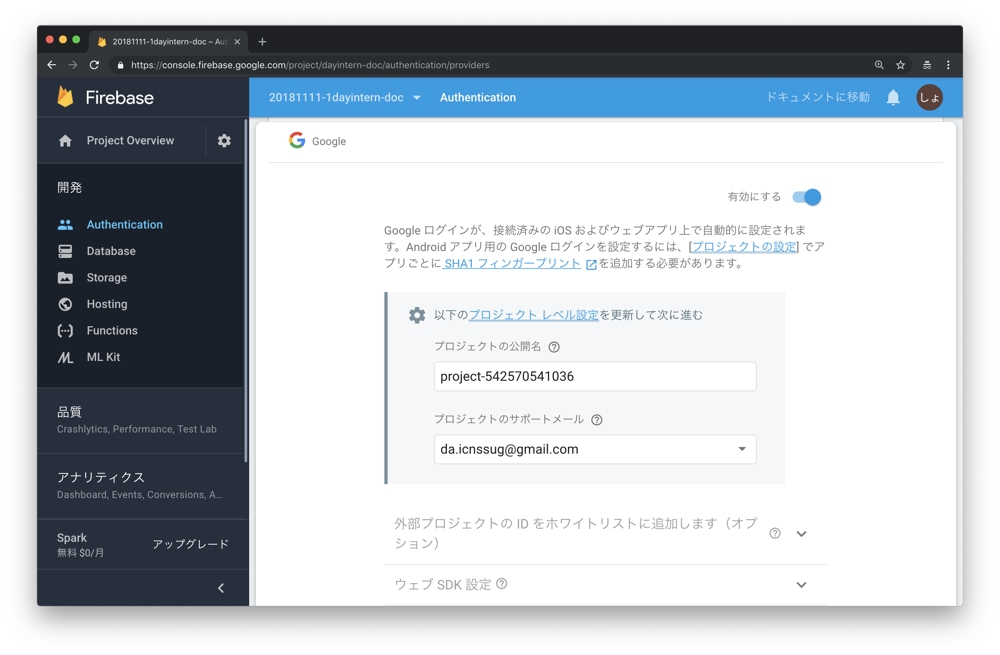

# チャットアプリ ライブコーディング
## Step 0. 開発環境セットアップ
1. ソースコードを取得する。
    - `$ git clone https://github.com/rettar5/20181111_1day_intern.git`
    - `$ cd 20181111_1day_intern.git`
1. 穴埋め用のソースコードに切り替える。
    - `$ git checkout fill-in-the-blank`
        - アプリの完成品は `master` ブランチで管理されています。

## Step 1. Firebase セットアップ
このステップでは、チャットアプリの認証・データ管理・デプロイに利用する __Firebase__ のセットアップを行います。  

1. [https://console.firebase.google.com](https://console.firebase.google.com)にアクセスし、Firebaseのプロジェクトを新規作成する。
      
      
      
      
      
1. Googleアカウントでの認証を有効化する。
      
      
      
1. Database（Cloud Firestore）を作成する。
      
      
      
1. Databaseのアクセス権（ルール）を設定する。

    ```diff
    service cloud.firestore {
      match /databases/{database}/documents {
        match /{document=**} {
    -     allow read, write;
    +     allow read, write: if request.auth.uid != null;
        }
      }
    }
    ```

      
      
      
1. AngularアプリからFirebaseにアクセスするための情報を取得する。
    - 最後に表示される情報をメモしておいてください。  

      
      
      
1. Firebaseへのアクセス情報をAngularアプリに設定する。
    - `$ cp chatapp/src/environments/firebase.config.ts.sample chatapp/src/environments/firebase.config.ts`
    - `$ vi chatapp/src/environments/firebase.config.ts`
        - 6でメモしたconfigの内容で上書きしてください。
          

## Step 2. Angular セットアップ
このステップでは、チャットアプリの開発に利用する __Angular__ のセットアップを行います。  

1. Dockerイメージをビルドする。
    - `$ ./bin/build-image`
        - コマンド `$ docker build -t rettar5/1dayintern .` が実行されます。
1. Dockerコンテナを作成・起動する。
    - `$ ./bin/run`
        - コマンド ```$ docker run -itd --rm --name 1dayintern -v /`pwd`/chatapp:/chatapp -p 4200:4200 -p 9005:9005 rettar5/1dayintern``` が実行されます。
    - コマンドに成功するとバックグラウンドで起動し続けます。
1. Dockerコンテナのログを出力する。
    - `$ ./bin/logs`
        - コマンド `$ docker logs -f 1dayintern` が実行されます。
    -  `｢wdm｣: Compiled successfully.` と表示されるまでしばらく待ってください。
1. ブラウザでアクセスする。
    - Chrome等で、 `http://localhost:4200` にアクセスしてください。
    - ログイン後、タイムラインが表示されれば次のステップに進みます。
      
      

## Step 3. ログイン中のユーザ情報の取得・表示の実装
このステップでは、 __Angular__ アプリから __Cloud Firestore__ のデータを取得し画面に表示する処理を実装します。  

| ファイル名 | 実装する処理 |
|:---|:---|
| `src/app/services/users/users.service.ts` | __Cloud Firestore__ からデータを取得。 |
| `src/app/components/main/main.components.ts` | `users.service` で取得したスナップショットからユーザ情報に変換。 |
| `src/app/components/main/main.components.html` | `login-user-profile.component` に、取得したユーザ情報を受け渡し。 |
| `src/app/components/login-user-profile/login-user-profile.component.ts` | `main.component` から渡されたユーザ情報を受け取り。 |
| `src/app/components/login-user-profile/login-user-profile.component.html` | ユーザ名やメールアドレス等を表示。 |

### Step 3-1. ユーザ情報の取得
1. `main.component.ts` を開く。
1. メソッド `fetchLoginUserData()` 内で、Firestoreのスナップショット（Firestoreのフォーマット）を取得し、ユーザ情報に変換する。

    ```typescript
    /** Firestoreからユーザ情報を取得 */
    private fetchLoginUserData() {
      // TODO: ユーザ情報取得処理を実装
      // ログイン中のユーザIDを、ローカルストレージから取得
      const loginId = DataStoreService.getItem(LocalStorageKey.loginId);
      // ユーザIDを使ってFirestoreからユーザ情報を取得
      this.users.fetchUserData(loginId).subscribe((snapshot) => {
        this.loginUser = new UserData(snapshot);
        console.log('loginUser: ', this.loginUser);
      });
    }
    ```

1. `DataStoreService` と `LocalStorageKey` をインポートする。

    ```typescript
    import { DataStoreService, LocalStorageKey } from 'src/app/services/data-store/data-store.service';
    ```

1. `users.service.ts` を開く。
1. メソッド `fetchUserData()` が未実装のため、データ取得処理を実装する。

    ```typescript
    /** Firestoreからユーザ情報を取得
     *
     * @param id ユーザID
     */
    fetchUserData(id: string): Observable<firebase.firestore.DocumentSnapshot> {
      // TODO: ユーザ情報取得取得処理の実装
      const doc = this.afs.doc<UserData>(FirestoreKeys.users + '/' + id);
      return doc.get();
    }
    ```
1. すべての変更を保存し、ブラウザを開く。
1. （Chromeの場合）画面を右クリックし、検証を選択して開発ツールを表示する。
    
1. Consoleタブを選択し、ログ出力を確認する。
    - Step 3-1が正しく実装されていれば、現在ログインしているユーザ情報が表示されます。
      
1. `main.component.ts` を開く
1. 不要になった `console.log('loginUser: ', this.loginUser);` を削除する。
    ```typescript
    /** Firestoreからユーザ情報を取得 */
    private fetchLoginUserData() {
      // ログイン中のユーザIDを、ローカルストレージから取得
      const loginId = DataStoreService.getItem(LocalStorageKey.loginId);
      // ユーザIDを使ってFirestoreからユーザ情報を取得
      this.users.fetchUserData(loginId).subscribe((snapshot) => {
        this.loginUser = new UserData(snapshot);
      });
    }
    ```

### Step 3-2. 子コンポーネントへのユーザ情報の受け渡し
1. `main.component.html` を開く。
1. 子コンポーネントのタグの属性に、ユーザ情報を渡す（バインド）設定を追加する。
    ```html
    <!-- TODO: ユーザ情報のバインド -->
    <app-login-user-profile [user]='loginUser'></app-login-user-profile>
    ```
1. `login-user-profile.component.ts` を開く。
1. 親コンポーネントからユーザ情報を受けるインターフェースを実装する。
    - `Input` と `UserData` もインポートしてください。

    ```typescript
    // TODO: ユーザ情報のバインド
    @Input() user: UserData;
    dummyImagePath = DummyImagePath;
    ```

1. `Input` と `UserData` をインポートする。

    ```typescript
    import { Component, OnInit, Input } from '@angular/core';
    import { UserData } from 'src/app/services/users/users.service';
    ```

1. 子コンポーネントにユーザ情報が渡ってきているかをチェックする。
    ```tyepscript
    ngOnInit() {
    }

    ngOnChanges() {
      if (this.user) {
        console.log('LoginUserProfile user: ', this.user);
      }
    }
    ```
1. すべての変更を保存し、ブラウザを開く。
    - Step 3-2が正しく実装されていれば、コンソールにユーザ情報が表示されます。
    
1. ユーザ情報のチェックに使った `ngOnChanges()` を削除する。
    ```tyepscript
    ngOnInit() {
    }
    ```

### Step 3-3. ユーザ情報の表示
1. ユーザ名を表示させるため、 `login-user-profile.component.html` を開く。
1. `login-user-profile.component.ts` で受け取った `user` を使い、ユーザ名を表示する。
    ```html
    <!-- TODO: ユーザ名表示 -->
    <div class='user_texts_name'>
      {{ user?.name }}
    </div>
    ```
1. すべての変更を保存し、ブラウザを開く。
    - 正しく実装されていれば、画面左下にユーザ名が表示されます。
      
1. 同様に `user` を使い、ユーザのメールアドレスを表示する。
    ```html
    <!-- TODO: メールアドレス表示 -->
    <div class='user_texts_email'>
      {{ user?.email }}
    </div>
    ```

    
1. `login-user-profile.component.scss` を開く。
1. ユーザ名・メールアドレスのスタイルを実装する。
    ```scss
    // TODO: ユーザ名・メールアドレス
    &_name,
    &_email {
      overflow: hidden;
      white-space: nowrap;
      text-overflow: ellipsis;
    }

    &_email {
      color: $fontCaptionColor;
      font-size: $fontCaptionSize;
    }
    ```

    
1. ログイン中のユーザのアイコンを表示させるため `login-user-profile.component.html` を開く。
1. ユーザのアイコンの表示を実装する。
    ```html
    <!-- TODO: アイコン表示 -->
    
    ```
1. `login-user-profile.component.scss` を開く。
1. ユーザのアイコンの大きさ等を調整する。
    ```scss
    // TODO: アイコン
    &_picture {
      height: 2rem;
      width: 2rem;
      border-radius: 50%;
      flex: none;
    }
    ```
1. すべての変更を保存し、ブラウザを開く。
    - Step 3のすべてが正しく実装されていれば、画面左下にユーザ名・メールアドレス・アイコンが表示されます。
    

## Step 4. グループの新規作成の実装
このステップでは、UIライブラリ __Angular Material__ を利用したボタンの追加や、 __Angular__ の __Form Control__ を利用したグループ名のバリデーションチェックを実装します。

| ファイル名 | 実装する処理 |
|:---|:---|
| `src/app/components/groups/groups.component.ts` | Form Controlを使ったバリデーションチェック。 |
| `src/app/components/groups/groups-register-dialog.component.html` | ボタンの追加。<br>クリックイベントのバインド（メソッド関連付け）。<br> |

### Step 4-1. Angular Materialのボタン追加
1. ブラウザで開き、左のプラスアイコンをクリックする。
    - ダイアログが表示されるが、ボタンが実装されていない。
    
1. ボタンを追加するため、 `groups-register-dialog.component.html` を開く。
1. [Angular Material Button](https://material.angular.io/components/button/examples)を参考に、ボタンを実装する。
    ```html
    <div mat-dialog-actions class='dialog_actions'>
      <!-- TODO: キャンセル・作成ボタンの実装 -->
      <button mat-button class='dialog_actions_cancel'>
        キャンセル
      </button>
      <button mat-button class='dialog_actions_create'>
        作成
      </button>
    </div>
    ```
1. すべての変更を保存し、ブラウザを開く。
    - ボタンは表示されるようになりますが、押しても何も起きません。
    
1. キャンセルボタンをクリックした際の処理を実装する。
    - メソッド `onCancelButtonClick()` が用意されているため、 `(click)` でイベントとメソッドを紐づけます。

    ```html
    <div mat-dialog-actions class='dialog_actions'>
      <!-- TODO: キャンセル・作成ボタンの実装 -->
      <button mat-button (click)='onCancelButtonClick()' class='dialog_actions_cancel'>
        キャンセル
      </button>
      <button mat-button class='dialog_actions_create'>
        作成
      </button>
    </div>
    ```
1. [Angular Material Dialog](https://material.angular.io/components/dialog/api#MatDialogClose)を参考に、作成ボタンをクリックした際にフォームの内容がセットされるよう実装する。
    ```html
    <mat-form-field class='dialog_content_form'>
      <!-- TODO: 入力必須・文字数制限の実装 -->
      <input matInput class='dialog_content_form_input' #input>
    </mat-form-field>
    ```
    
    ```html
    <!-- TODO: キャンセル・作成ボタンの実装 -->
    <button mat-button (click)='onCancelButtonClick()' class='dialog_actions_cancel'>
      キャンセル
    </button>
    <button mat-button [mat-dialog-close]='input?.value' class='dialog_actions_create'>
      作成
    </button>
    ```
1. すべての変更を保存し、ブラウザを開く。
    - Step 4-1が正しく実装されていれば、 __キャンセル__ でダイアログが閉じ、 __作成__ でグループが作成されます。
    

### Step 4-2. 入力欄の入力必須・文字数制限
1. 入力欄が空でも作成のボタンがクリックできてしまうため、 `groups.component.ts` を開く。
1. 入力欄を制御する __Form Control__ を生成する。
    ```typescript
    // TODO: 入力必須・文字数制限の実装
    control: FormControl = new FormControl(null, [Validators.required]);
    ```
1. `groups-register-dialog.component.html` を開く。
1. 入力欄に生成した __Form Control__ を セットする。
    ```html
    <mat-form-field class='dialog_content_form'>
      <!-- TODO: 入力必須・文字数制限の実装 -->
      <input matInput [formControl]='control' class='dialog_content_form_input'>
    </mat-form-field>
    ```
1. Step 4-1で実装した「クリック時にフォームの内容をセットする処理」を __Form Control__ に置き換える。
    ```html
    <div mat-dialog-actions class='dialog_actions'>
      <!-- TODO: キャンセル・作成ボタンの実装 -->
      <button mat-button (click)='onCancelButtonClick()' class='dialog_actions_cancel'>
        キャンセル
      </button>
      <button mat-button [mat-dialog-close]='control.value' class='dialog_actions_create'>
        作成
      </button>
    </div>
    ```
1. __Form Control__ でバリデーションチェックを行い、作成ボタンの非活性を切り替える。
    ```html
    <div mat-dialog-actions class='dialog_actions'>
      <!-- TODO: キャンセル・作成ボタンの実装 -->
      <button mat-button (click)='onCancelButtonClick()' class='dialog_actions_cancel'>
        キャンセル
      </button>
      <button mat-button [mat-dialog-close]='control.value' [disabled]='!control.valid' class='dialog_actions_create'>
        作成
      </button>
    </div>
    ```
1. すべての変更を保存し、ブラウザを開く。
    - 正しく実装されていれば、フォームが空のときはボタンが非活性になります。
      
1. グループ名の文字数を制限するため、 `groups.component.ts` を開く。
1. バリデーションに最大文字数を追加する。
    ```typescript
    // TODO: 入力必須・文字数制限の実装
    control: FormControl = new FormControl(null, [Validators.required, Validators.maxLength(12)]);
    ```
1. すべての変更を保存し、ブラウザを開く。
    - 正しく実装されていれば、フォームが13文字以上のときにボタンが非活性になります。
      

### Step 4-3. 入力欄の初期値設定
1. 初期値を設定するため、 `groups.component.ts` を開く。
1. 初期値に使用する値が `data.name` に保存されているため、 __Form Control__ の初期値として設定する。
    ```typescript
    // TODO: 入力必須・文字数制限の実装
    control: FormControl = new FormControl(this.data.name, [Validators.required, Validators.maxLength(12)]);
    ```
1. すべての変更を保存し、ブラウザを開く。
    - 正しく実装されていれば、 `グループ名 + 数字` が入力欄に表示されます。
    

## Step 5. 多言語対応の実装
このステップでは、Angular向けのライブラリを利用して、アプリ内のテキストを多言語対応を実装します。  

| ファイル名 | 実装する処理 |
|:---|:---|
| `src/app/app.component.ts` | 多言語対応用リソースの読み込み。 |
| `src/app/components/login/login.component.ts` | 選択した言語コードの保存・表示。 |
| `src/app/components/login/login.component.html` | 表示しているテキストの多言語対応化。 |
| `src/assets/i18n/ja.json` | 日本語翻訳ファイル。 |
| `src/assets/i18n/en.json` | 英語翻訳ファイル。 |
| `src/assets/i18n/zh-cmn-Hans.json` | 中国語簡体字翻訳ファイル。 |
| `src/assets/i18n/global.json` | 各言語を1つにまとめた翻訳ファイル。 |

### Step 5-1. 選択した言語の保存・表示切り替え
1. ブラウザを開き、ログアウトをクリックしてログイン画面に移動する。
    - 言語を指定しても、リロードするともとに戻ってしまう。
      
1. 選択した言語を保存するため、 `login.component.ts` を開く。
1. ラジオボタンの値が変わった際に、 __Local Storage__ に選択した言語を保存する処理を実装する。
    ```typescript
    /** 使用する言語を切り替え
     *
     * @param lang 変更する言語
     */
    changeLang(lang: string) {
      // TODO: 選択した言語をローカルストレージに保存
      I18nService.setLang(lang);
      // TODO: 表示を選択した言語に切り替え
    }
    ```
1. `login.component` が表示された際に、「 __Local Storage__ に言語が保存されていれば、その言語を選択済みにする」処理を実装する。
    ```typescript
    ngOnInit() {
      // TODO: LocalStorageから保存済みの言語を取得
      this.selectedLang = I18nService.getLang();
    }
    ```
1. すべてを保存し、ブラウザの開発ツールの `Application > Storage > Local Storage > http://localhost:4200` をクリックする。
    - 正しく実装されていれば、ラジオボタンを切り替えた際に __Local Storage__ に保存されます。
      

### Step 5-2. 各言語のリソースの読み込み
1. `app.component.ts` を開く。
1. 各言語の翻訳ファイルを多言語対応用ライブラリに読み込む。
    ```typescript
    import { Component } from '@angular/core';
    import { TranslateService } from '@ngx-translate/core';

    const i18nJaResource = require('../assets/i18n/ja.json');
    const i18nEnResource = require('../assets/i18n/en.json');
    const i18nZhCmnHansResource = require('../assets/i18n/zh-cmn-Hans.json');
    ```
    
    ```typescript
    /** 多言語リソースを読み込み */
    private loadI18nResouces() {
      // TODO: リソース読み込み処理の実装
      this.translate.setTranslation('ja', i18nJaResource);
      this.translate.setTranslation('en', i18nEnResource);
      this.translate.setTranslation('zh-cmn-Hans', i18nZhCmnHansResource);
    }
    ```
1. デフォルトの翻訳言語を日本語に設定する。
    ```typescript
    constructor(private translate: TranslateService) {
      // 多言語リソースを読み込み
      this.loadI18nResouces();
      // TODO: デフォルトの言語を日本語に設定
      this.translate.setDefaultLang('ja');
      // TODO: ローカルストレージに保存された言語に切り替え
    }
    ```
1. __Local Storage__ に保存されている言語コードを選択中の言語に切り替える。
    ```typescript
    constructor(private translate: TranslateService) {
      // 多言語リソースを読み込み
      this.loadI18nResouces();
      // TODO: デフォルトの言語を日本語に設定
      this.translate.setDefaultLang('ja');
      // TODO: ローカルストレージに保存された言語に切り替え
      this.translate.use(I18nService.getLang());
    }
    ```

1. `I18nService` をインポートする。

    ```typescript
    import { I18nService } from './services/i18n/i18n.service';
    ```

### Step 5-3. テキストの多言語対応化
1. ログインボタンを多言語対応するため、 `login.component.html` を開く。
1. `assets/i18n/ja.json` 等の翻訳ファイルを参考に、キーとパイプを設定する。
    ```html
    <button class='login_contents_button' mat-raised-button (click)='onLoginButtonClick($event)'>
      <!-- TODO: 多言語対応 -->
      {{ '@Login.loginByGoogle' | translate }}
    </button>
    ```
1. すべての変更を保存し、ブラウザを開く。
    - 正しく実装されていれば、各言語クリック後に画面をリロードすると、選択した言語に切り替わります。
      
1. 言語をクリックした際に翻訳を切り替えるため、 `login.component.ts` を開く。
1. メソッド `translate.use()` を使い、動的に言語を切り替える処理を追加する。
    ```typescript
    /** 使用する言語を切り替え
     *
     * @param lang 変更する言語
     */
    changeLang(lang: string) {
      // TODO: 選択した言語をローカルストレージに保存
      I18nService.setLang(lang);
      // TODO: 表示を選択した言語に切り替え
      this.translate.use(lang);
    }
    ```
1. すべての変更を保存し、ブラウザを開く。
    - 正しく実装されていれば、ユーザの操作に対して動的に翻訳が切り替わります。
      

### Step 5-4. 翻訳ファイルの管理 応用
多言語対応をする際に各言語での翻訳ファイルを読み込みましたが、ファイルが異なっていると __定義の漏れ__ や __各言語での翻訳の比較（他の人に翻訳の依頼をする時）__ など、メンテナンス性が悪いといった課題があります。  
`i18n.service.ts` に複数言語が記述されたJSONを、指定した言語のみのJSONに置き換えるメソッドを用意しているので、多言語対応に用いる翻訳ファイルを `global.json` に置き換えます。  

1. `app.component.ts` を開く。
1. Step 5-2で追加した各翻訳ファイルの読み込みを削除する。
    ```typescript
    import { Component } from '@angular/core';
    import { TranslateService } from '@ngx-translate/core';
    import { I18nService } from './services/i18n/i18n.service';
    ```
    
    ```typescript
    /** 多言語リソースを読み込み */
    private loadI18nResouces() {
      // TODO: リソース読み込み処理の実装
    }
    ```
1. `SupportedLangs` からサポートする言語の配列を1件ずつ取得する。
    - 取得した値は `lang` に代入されます。
    ```typescript
    /** 多言語リソースを読み込み */
    private loadI18nResouces() {
      // TODO: リソース読み込み処理の実装
      SupportedLangs.forEach((lang) => {
      });
    }
    ```

1. `SupportedLangs` をインポートする。

    ```typesceript
    import { I18nService, SupportedLangs } from './services/i18n/i18n.service';
    ```

1. サポートする言語の情報から翻訳用のJSONを取得し、多言語対応用ライブラリに読み込む。
    - メソッド `getResource()` は、 `global.json` の中から指定されたコードの翻訳を取得し、 `ja.json` 等と同じ形式のオブジェクトで返却します。
    ```typescript
    /** 多言語リソースを読み込み */
    private loadI18nResouces() {
      // TODO: リソース読み込み処理の実装
      SupportedLangs.forEach((lang) => {
        const resource = I18nService.getResource(lang.code);
        this.translate.setTranslation(lang.code, resource);
      });
    }
    ```

## Step 6. ユニットテスト（テスト自動化）の実装
このステップでは、各コンポーネントや各サービスに実装したメソッドのユニット（単体）テストを実装します。  

__注意__  
これまでDockerコンテナ内でアプリをビルドしていましたが、単体テスト・シナリオテストに使うブラウザがDockerコンテナにないため、 __Hostマシン（Mac）でアプリをビルド・テスト__ します。  
ビルドには __Node.js__ の __バージョン 10.0.0__ 以上が必要になるため、 __nodebrew__ 等で予めインストールを済ませておいてください。  

| ファイル名 | 実装する処理 |
|:---|:---|
| `src/app/services/data-store/data-store.service.spec.ts` | ローカルストレージに保存された値の取得・削除するメソッドのテストを追加。 |

### Step 6-1. 環境設定（既にシナリオテスト、またはデプロイで設定済みであればスキップ可）
1. Dockerコンテナを停止する。
    - `$ ./bin/stop`
1. チャットアプリのライブラリをインストールし直す。
    - `$ cd chatapp`
    - `$ mv node_modules node_modules_alpine`
        - バックアップが不要な場合は、 `$ rm -rf node_modules` で削除してください。
    - `$ npm install`
1. 作成済みのテストケースでテストを実行する。
    - `$ npm run test`
    

### Step 6-2. メソッド getItem() のテストケース追加
1. `data-store.service.spec.ts` を開く。
1. メソッド `getItem()` で、文字列が取得できるか確認するテスト項目を追加する。
    ```typescript
    describe('getItem()', () => {
      // TODO: ローカルストレージに保存された文字列が取得できること
      it('ローカルストレージに保存された文字列が取得できること', () => {
      });
    });
    ```
1. メソッド `getItem()` を使い、ローカルストレージから文字列を取得する処理を実装する。
    ```typescript
    describe('getItem()', () => {
      // TODO: ローカルストレージに保存された文字列が取得できること
      it('ローカルストレージに保存された文字列が取得できること', () => {
        const item = DataStoreService.getItem(strKey);
      });
    ```
1. 取得できた値 `item` が、保存していた値 `str` と一致するかどうかを検証する。
    ```typescript
    describe('getItem()', () => {
      // TODO: ローカルストレージに保存された文字列が取得できること
      it('ローカルストレージに保存された文字列が取得できること', () => {
        const item = DataStoreService.getItem(strKey);
        expect(item).toBe(str);
      });
    ```
1. 同様にメソッド `getItem()` で、オブジェクトが取得できるか確認するテスト項目を追加する。
    ```typescript
    describe('getItem()', () => {
      // TODO: ローカルストレージに保存された文字列が取得できること
      it('ローカルストレージに保存された文字列が取得できること', () => {
        const item = DataStoreService.getItem(strKey);
        expect(item).toBe(str);
      });

      // TODO: ローカルストレージに保存されたオブジェクトが取得できること
      it('ローカルストレージに保存されたオブジェクトが取得できること', () => {
        const item = DataStoreService.getItem(objKey);
        expect(item).toBe(JSON.stringify(obj));
      });
    });
    ```
1. すべての変更を保存し、ユニットテストが成功するか確認する。
    - 正しく実装されていれば、緑色の画面が表示され、総テスト数が2件増える。
    

## Step 7. シナリオテスト（テスト自動化）の実装
このステップでは、アプリ全体の自動テストを実装します。  

__注意__  
これまでDockerコンテナ内でアプリをビルドしていましたが、単体テスト・シナリオテストに使うブラウザがDockerコンテナにないため、 __Hostマシン（Mac）でアプリをビルド・テスト__ します。  
ビルドには __Node.js__ の __バージョン 10.0.0__ 以上が必要になるため、 __nodebrew__ 等で予めインストールを済ませておいてください。  
またシナリオテストでは非同期処理を同期処理するための __Promise__ という仕組みを利用します。  
__Promise__ は少し複雑であるため、事前に予習しておくことをおすすめします。  

| ファイル名 | 実装する処理 |
|:---|:---|
| `e2e/account.config.ts` | シナリオテストでログインするユーザ設定ファイル。 |
| `e2e/src/app.e2e-spec.ts` | テストを行うシナリオを定義。 |
| `e2e/src/message-inut.po.ts` | `message-input.component` 内のユーティリティを定義。 |

### Step 7-1. シナリオテスト用 ユーザ設定
1. ユーザ設定用ファイルをサンプルから作成する。
    - `$ cp e2e/account.config.ts.sample e2e/account.config.ts`
1. シナリオテストでログインするユーザ情報を設定する。
    - パスワードが平文で保存されるかつ、2段階認証に対応していないため、テスト用アカウントで設定することを推奨します。
    ```typescript
    export const accountConfig = {
      email: 'ログインするユーザのメールアドレス',
      password: 'ログインするユーザのパスワード',
      name: 'ログインするユーザ名'
    };
    ```

### Step 7-2. 環境設定（既にユニットテスト、またはデプロイで設定済みであればスキップ可）
1. Dockerコンテナを停止する。
    - `$ ./bin/stop`
1. チャットアプリのライブラリをインストールし直す。
    - `$ cd chatapp`
    - `$ mv node_modules node_modules_alpine`
        - バックアップが不要な場合は、 `$ rm -rf node_modules` で削除してください。
    - `$ npm install`
1. 作成済みのテストケースでテストを実行する。
    - `$ npm run e2e`
      

### Step 7-3. メッセージを投稿するシナリオテスト実装
1. シナリオテストが定義されている `app.e2e-spec.ts` を開く。
1. 投稿ボタンを押してメッセージが投稿できるかどうかを確認する項目を追加する。
    ```typescript
    for(const testCase of testCases) {
      /// TODO: 投稿ボタンからメッセージが投稿できること
      it('投稿ボタンからメッセージが投稿できること', () => {
      });

      // TODO: エンターキーからメッセージが投稿できること
    }
    ```
1. 内容がユニークとなる文字列を生成し、変数 `message` に代入する。
    ```typescript
    for(const testCase of testCases) {
      /// TODO: 投稿ボタンからメッセージが投稿できること
      it('投稿ボタンからメッセージが投稿できること', () => {
        const message = testCase.base + ' ' + Date.now();
      });

      // TODO: エンターキーからメッセージが投稿できること
    }
    ```
1. ループ内で投稿のテストをしているため、直前のテストが終わるのを待つために500ミリ秒の待ちを追加する。
    ```typesceript
    for(const testCase of testCases) {
      /// TODO: 投稿ボタンからメッセージが投稿できること
      it('投稿ボタンからメッセージが投稿できること', () => {
        const message = testCase.base + ' ' + Date.now();
        appPage.sleep(interval).then(() => {
        });
      });

      // TODO: エンターキーからメッセージが投稿できること
    }
    ```
1. `message-input` のユーティリティを使い、メッセージ入力欄にメッセージをセットする。
    ```typescript
    for(const testCase of testCases) {
      /// TODO: 投稿ボタンからメッセージが投稿できること
      it('投稿ボタンからメッセージが投稿できること', () => {
        const message = testCase.base + ' ' + Date.now();
        appPage.sleep(interval).then(() => {
          return messageInputPage.setMessage(message, testCase.hasEmoji);
        });
      });

      // TODO: エンターキーからメッセージが投稿できること
    }
    ```
1. `message-input` のユーティリティを使い、投稿ボタンをクリックする。
    ```typescript
    for(const testCase of testCases) {
      /// TODO: 投稿ボタンからメッセージが投稿できること
      it('投稿ボタンからメッセージが投稿できること', () => {
        const message = testCase.base + ' ' + Date.now();
        appPage.sleep(interval).then(() => {
          return messageInputPage.setMessage(message, testCase.hasEmoji);
        }).then(() => {
          return messageInputPage.clickPostButton();
        });
      });

      // TODO: エンターキーからメッセージが投稿できること
    }
    ```
1. `timeline` のユーティリティを使い、最後に投稿されたメッセージの要素を取得する。
    ```typescript
    for(const testCase of testCases) {
      /// TODO: 投稿ボタンからメッセージが投稿できること
      it('投稿ボタンからメッセージが投稿できること', () => {
        const message = testCase.base + ' ' + Date.now();
        appPage.sleep(interval).then(() => {
          return messageInputPage.setMessage(message, testCase.hasEmoji);
        }).then(() => {
          return messageInputPage.clickPostButton();
        }).then(() => {
          return timelinePage.getLastMessageElement();
        });
      });

      // TODO: エンターキーからメッセージが投稿できること
    }
    ```
1. `message-cell` のユーティリティを使い、要素からメッセージの本文を取得する。
    ```typescript
    for(const testCase of testCases) {
      /// TODO: 投稿ボタンからメッセージが投稿できること
      it('投稿ボタンからメッセージが投稿できること', () => {
        const message = testCase.base + ' ' + Date.now();
        appPage.sleep(interval).then(() => {
          return messageInputPage.setMessage(message, testCase.hasEmoji);
        }).then(() => {
          return messageInputPage.clickPostButton();
        }).then(() => {
          return timelinePage.getLastMessageElement();
        }).then((element) => {
          return messageCellPage.getBodyTextByElement(element);
        });
      });

      // TODO: エンターキーからメッセージが投稿できること
    }
    ```
1. 取得したメッセージの本文が、投稿した内容と一致するかを検証する。
    ```typescript
    for(const testCase of testCases) {
      /// TODO: 投稿ボタンからメッセージが投稿できること
      it('投稿ボタンからメッセージが投稿できること', () => {
        const message = testCase.base + ' ' + Date.now();
        appPage.sleep(interval).then(() => {
          return messageInputPage.setMessage(message, testCase.hasEmoji);
        }).then(() => {
          return messageInputPage.clickPostButton();
        }).then(() => {
          return timelinePage.getLastMessageElement();
        }).then((element) => {
          return messageCellPage.getBodyTextByElement(element);
        }).then((text) => {
          expect(text).toEqual(message);
        });
      });

      // TODO: エンターキーからメッセージが投稿できること
    }
    ```

### Step 7-4. メッセージ投稿関連のユーティリティ実装
1. `message-input.po.ts` を開く。
1. 指定されたメッセージの内容を入力欄に書き込む処理を実装する。
    ```typescript
    setMessage(message: string, hasEmoji: boolean = false) {
      if (hasEmoji) {
        return this.setMessageByScript(message);
      } else {
        // TODO: メッセージを入力する
        return element(by.css(selectors.fieldInput)).sendKeys(message);
      }
    }
    ```
1. 投稿ボタンをクリックする処理を実装する。
    ```typescript
      clickPostButton() {
        // TODO: クリックする
        return element(by.css(selectors.button)).click();
      }
    ```
1. すべての変更を保存し、テストを実行する。
    - `$ npm run e2e`
    - 正しく実装されていれば、「投稿ボタンからメッセージが投稿できること」が増え、チェックが入る。

    


## Step 8. Firebase Hostingへのデプロイ
このステップでは、 __Firebase__ の __Hosting__ を利用し、作成したアプリをオンライン上に公開します。  

__注意__  
これまでDockerコンテナ内でアプリをビルドしていましたが、単体テスト・シナリオテストに使うブラウザがDockerコンテナにないため、 __Hostマシン（Mac）でアプリをビルド・テスト__ します。  
ビルドには __Node.js__ の __バージョン 10.0.0__ 以上が必要になるため、 __nodebrew__ 等で予めインストールを済ませておいてください。  

### Step 8-1. 環境設定（既にユニットテスト、またはシナリオテストで設定済みであればスキップ可）
1. Dockerコンテナを停止する。
    - `$ ./bin/stop`
1. チャットアプリのライブラリをインストールし直す。
    - `$ cd chatapp`
    - `$ mv node_modules node_modules_alpine`
        - バックアップが不要な場合は、 `$ rm -rf node_modules` で削除してください。
    - `$ npm install`

### Step 8-2. Firebase Hostingの初期化
1. コマンドを実行し、Firebaseにログインする。
    - `$ npm run firebase login`
1. ブラウザが表示されるため、ログインするアカウントを選択する。
      
      
      
      
1. Hosting向けにプロジェクトを初期化する。
    - `$ npm run firebase init`
    - コマンド実行時に表示される選択肢は、以下のように選択する。
        - Which Firebase CLI features do you want to setup for this folder? Press Space to select features, then Enter to confirm your choices. (Press <space> to select)
            - `Hosting: Configure and deploy Firebase Hosting sites`
        - Select a default Firebase project for this directory:
            - Step 1で作成したアプリを選択
        - What do you want to use as your public directory?
            - `dist`
        - Configure as a single-page app (rewrite all urls to /index.html)?
            - `y`

    

### Step 8-3. Angularアプリのビルド
1. コマンドを実行し、AngularのソースコードをHTML, CSS, JavaScript等に変換する。
    - `$ npm run build`

    

### Step 8-4. Firebase Hostingへのデプロイ
1. コマンドを実行し、 `dist` 内のファイルをHostingへアップロードする。
    - `$ npm run firebase deploy`
    
    

1. ブラウザで `Hosting URL: ` に書かれたURLへアクセスする。
    


